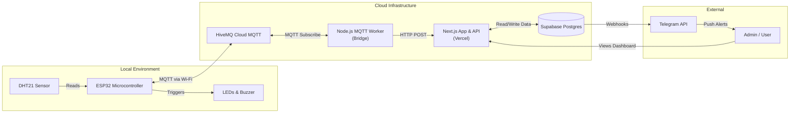
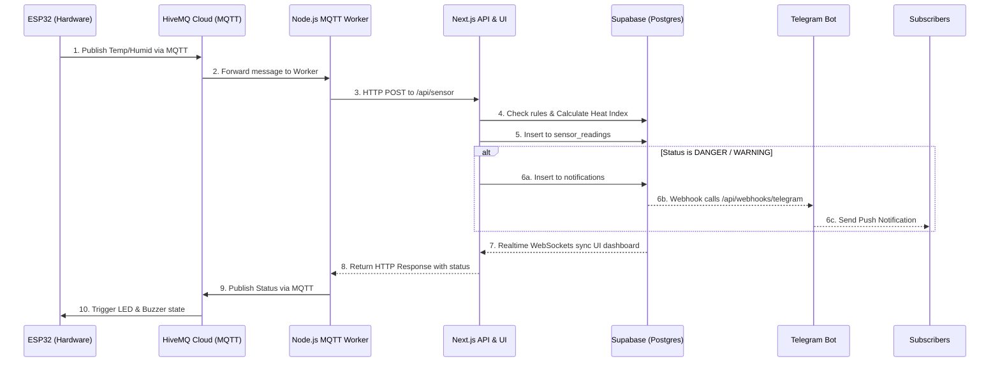
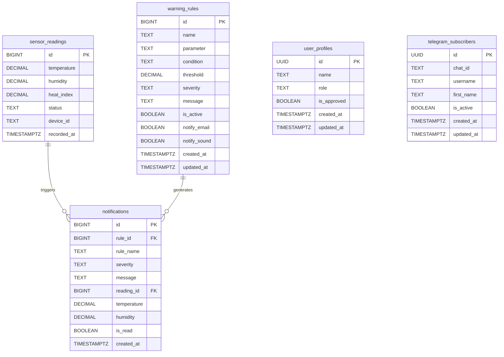
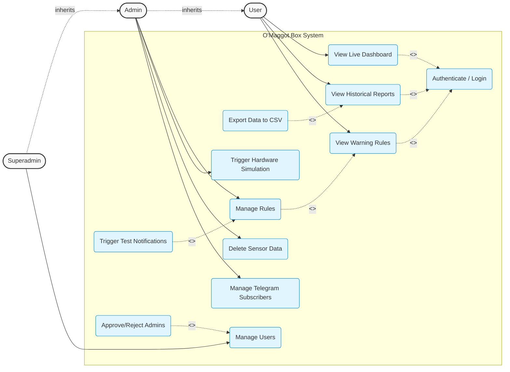
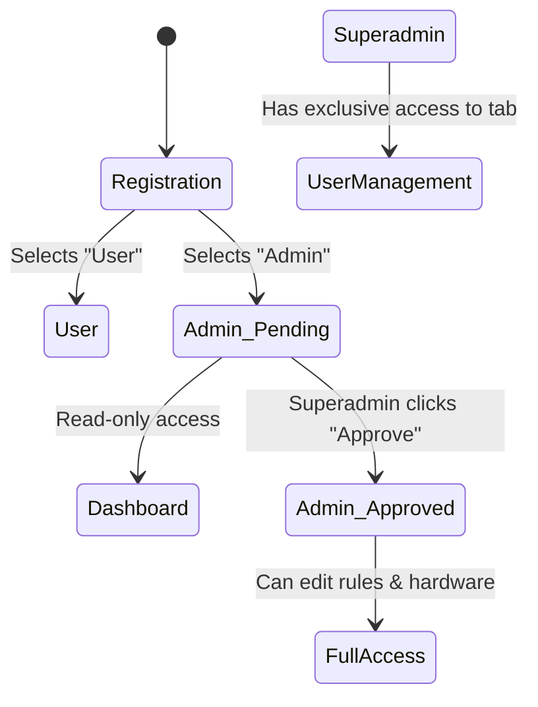

# O'Maggot Box V2
An enterprise-grade Internet of Things (IoT) environmental monitoring system specifically designed for Black Soldier Fly (BSF) Maggot cultivation.

BSF maggots require precise temperature and humidity ranges to thrive. This system provides real-time monitoring, automated alerts, and comprehensive historical data analysis to ensure optimal breeding conditions and maximize yield.

---

## 🏗️ System Architecture

To help developers and stakeholders understand the system at a glance, here is the breakdown of physical hardware, cloud services, and the database.

### 1. Component Architecture
This diagram outlines the physical and cloud boundaries of the system.



*Explanation:* This diagram maps out the physical and logical boundaries of the system. In the **Local Environment**, the ESP32 microcontroller interfaces directly with DHT21 sensors to gather climate data, controlling physical actuators (LEDs & Buzzer) based on status changes. Because the ESP32 operates on limited power/compute, it streams data to a **Cloud Infrastructure** layer using the lightweight MQTT protocol via HiveMQ. A Node.js Worker bridges this MQTT stream into our Next.js API, which stores the data securely in Supabase. Finally, the **External** layer shows how end-users interact with the system - either by viewing the Next.js Dashboard or receiving automated webhook alerts pushed through the Telegram API.

### 2. Data Flow (Sequence)
This diagram illustrates the chronological step-by-step flow when a sensor reading occurs.



*Explanation:* This sequence diagram traces the complete journey of a single sensor reading. It starts on the left when the ESP32 publishes a payload. The HiveMQ broker routes this to our Node.js Worker, which fires an HTTP POST to the Next.js backend. Inside Next.js, business logic executes: it calculates the Heat Index and evaluates the reading against active warning rules. The data is saved to Supabase Postgres. If a rule triggers a Warning or Danger state, Supabase immediately fires a webhook to Telegram to alert farmers. Simultaneously, Supabase's Realtime engine pushes the new data via WebSockets to any admin viewing the Dashboard. Finally, the resulting status is sent back down the chain to the ESP32 so it can trigger local visual/audio alarms (LEDs/Buzzer).

### 3. Database Schema (ERD)
This Entity-Relationship Diagram details the relational PostgreSQL database structure hosted on Supabase.



*Explanation:* The ERD represents the relational structure of our Supabase PostgreSQL database. At its core is the `sensor_readings` table storing chronological climate data. The `warning_rules` table stores the user-defined thresholds (e.g., "Alert if Temperature > 35"). When a reading violates a rule, a record is generated in the `notifications` table, linking the specific reading and rule together for historical auditing. Separately, the system handles access control via `user_profiles` (which ties into Supabase Auth) and manages alert recipients in the `telegram_subscribers` table.

---

## 🧠 Critical Analysis: Why These Technologies?

Building a reliable IoT system requires bridging the gap between embedded hardware (C++), continuous data streams, and modern web applications. Here is the critical reasoning behind our technology stack choices:

### 1. Supabase (PostgreSQL) vs Traditional Databases
- **What we needed:** A secure database that can handle rapid time-series inserts from IoT devices, while instantly updating the frontend dashboard without heavy polling.
- **Why we chose it:** Supabase provides **PostgreSQL** out of the box with built-in **Row Level Security (RLS)** and **Realtime WebSockets**. 
- **The Benefit:** Instead of writing complex WebSocket servers (Socket.io) to push new temperature readings to the browser, Supabase Realtime allows the Next.js frontend to simply subscribe to database changes. RLS ensures that public users cannot write or delete data directly from the browser, pushing all write-privileges to secure backend API routes.

### 2. Next.js App Router vs Express.js
- **What we needed:** A robust administrative dashboard and secure API endpoints to process rules.
- **Why we chose it:** Next.js provides Server-Side Rendering (SSR) and seamless API routes in a single repository.
- **The Benefit:** Deploying to Vercel is trivial, SEO is perfect (if the landing page scales), and UI components (Tailwind, Framer Motion) integrate seamlessly. However, because Vercel API routes are *serverless* (they shut down when not in use), they cannot hold open continuous MQTT connections. This limitation led directly to the next architectural decision:

### 3. MQTT (HiveMQ) + Node.js Worker Bridge
- **What we needed:** A reliable way for the ESP32 to stream data 24/7 without draining battery or dropping packets due to HTTP overhead.
- **Why we chose it:** MQTT is the industry standard for IoT - it is lightweight, requires minimal bandwidth, and maintains persistent connections. Since Next.js serverless functions cannot subscribe to MQTT continuously, we introduced a standalone **Node.js MQTT Worker**.
- **The Benefit:** The Worker acts as a translator. It holds the persistent MQTT connection open, receives the ultra-lightweight payload from the ESP32, and fires a standard HTTP POST request to the Next.js API. This gives us the best of both worlds: efficient IoT hardware communication and scalable serverless backend APIs.

### 4. Telegram Bot over Custom Push Notifications
- **What we needed:** Immediate alerts to farmers when the maggot box temperature reaches DANGER levels.
- **Why we chose it:** Building a custom mobile app strictly for push notifications is expensive, hard to maintain, and causes friction (users don't want to download another app). 
- **The Benefit:** Telegram offers a free, highly reliable Bot API. Farmers simply send `/subscribe` to the bot, and Supabase Database Webhooks automatically POST to our API which pushes the alert to Telegram. Zero app installations required, instant delivery.

---

## 🌡️ Heat Index (Indeks Kenyamanan)

In the BSF (Black Soldier Fly) cultivation process, it's not just the absolute temperature that matters, but how "hot" the environment feels to the maggots when combined with humidity. This is known as the **Heat Index**. 

The system automatically calculates the Heat Index server-side using a modified Rothfusz formula whenever temperature and humidity readings are received. 

**Calculation Range & Rules:**
- The formula is only applied when the temperature is **&ge; 26.7 °C** and the humidity is **&ge; 40%**. 
- If the environmental conditions are below these thresholds, the system defaults the Heat Index to be equal to the current temperature, as the humidity does not significantly amplify the perceived heat.
- This computed value is then evaluated against user-defined threshold rules (Normal, Warning, Danger) exactly like raw temperature or humidity.

---

## 👥 Pembagian Roles (Role Distribution & Access Control)

To maintain strict security - especially concerning hardware simulation and alert rule modifications - the system implements a robust Role-Based Access Control (RBAC) mechanism. 

There are three distinct roles in the system. Here is exactly what they can and cannot do:

| Feature / Capability | User (Normal) | Admin (Pending) | Admin (Approved) | Superadmin |
| :--- | :---: | :---: | :---: | :---: |
| **View Live Dashboard** | ✅ | ✅ | ✅ | ✅ |
| **View Reports & Export Data**| ✅ | ✅ | ✅ | ✅ |
| **View Warning Rules** | ✅ | ✅ | ✅ | ✅ |
| **Create / Edit / Delete Rules**| ❌ | ❌ | ✅ | ✅ |
| **Toggle Rules On/Off** | ❌ | ❌ | ✅ | ✅ |
| **Delete Sensor Data (Reports)**| ❌ | ❌ | ✅ | ✅ |
| **Trigger Test Notifications** | ❌ | ❌ | ✅ | ✅ |
| **Trigger Hardware Simulation**| ❌ | ❌ | ✅ | ✅ |
| **Manage / Remove Subscribers**| ❌ | ❌ | ✅ | ✅ |
| **Approve / Reject Admins** | ❌ | ❌ | ❌ | ✅ |

### System Use Case Diagram

The following diagram illustrates the functionalities from the perspective of the three primary roles, using standard UML actor-inheritance conventions.



*Explanation:* 
- **Actors & Inheritance:** We use standard UML actor generalization (`--|>`). The `Superadmin` inherits everything from `Admin`, and `Admin` inherits everything from `User`.
- **`<<include>>` (Mandatory):** Viewing the Dashboard, Reports, or Rules strictly requires the user to **Authenticate / Login** first. The base use cases cannot execute without it.
- **`<<extend>>` (Optional):** Extending use cases provide optional functionality to a base use case. For example, while viewing reports, a user can optionally **Export Data to CSV**. While viewing rules, an Admin can optionally **Manage Rules** (Create/Edit/Toggle). While managing users, a Superadmin can optionally **Approve/Reject Admins**.
- **Roles:**
  - **User (Normal User):** Has read-only capabilities (Dashboard, Reports, Rules).
  - **Admin (Approved):** Gains write-access to the system state (Managing rules, deleting data, testing hardware/notifications).
  - **Superadmin:** The highest-level actor with exclusive authority over User Management.

### The "Pending Admin" Workflow (State Diagram)

To prevent anyone from registering as an Admin and immediately messing with critical temperature thresholds, we introduced an `is_approved` flag.



> [!IMPORTANT]  
> **Creating the First Superadmin:**  
> For maximum security, the "Superadmin" role cannot be selected via the UI during registration. Hardcoding a secret path to become a Superadmin is a massive security vulnerability. 
> 
> You must promote your first account manually via the database:
> 1. Register an account normally at `/register`.
> 2. Open the **Supabase Dashboard SQL Editor**.
> 3. Run the following query:
>    ```sql
>    UPDATE user_profiles 
>    SET role = 'superadmin', is_approved = true 
>    WHERE id = (SELECT id FROM auth.users WHERE email = 'your@email.com');
>    ```
> 4. Refresh your dashboard. You will now see the exclusive **User Management** tab, allowing you to securely approve all future Admins from the UI.

---

## 🚀 Step-by-Step Setup Guide

### Phase 1: Database Setup (Supabase)
1. Create a new Supabase project.
2. In the root directory, open `setup-db.js` and update the connection string with your Supabase database URL and password.
3. Run `node setup-db.js` to automatically generate the necessary tables, Row-Level Security (RLS) policies, and enable Realtime WebSockets.

### Phase 2: Environment Configuration
1. Navigate to the `web` directory and copy `.env.example` to a new file named `.env.local`.
2. Populate the Supabase credentials (`NEXT_PUBLIC_SUPABASE_URL`, `NEXT_PUBLIC_SUPABASE_ANON_KEY`, `SUPABASE_SERVICE_ROLE_KEY`).
3. Populate the HiveMQ Cloud credentials (`HIVEMQ_HOST`, `HIVEMQ_PORT`, `HIVEMQ_USERNAME`, `HIVEMQ_PASSWORD`).
4. Define a secure `ESP32_API_KEY` to authenticate incoming sensor payloads from the Worker.
5. Define `NEXT_PUBLIC_APP_URL` (e.g., `http://localhost:3000` or your production domain).

### Phase 3: Telegram Bot Integration
> [!WARNING]  
> **Local Development Note:** Telegram webhooks cannot reach `http://localhost`. If you are testing locally, you MUST use a tunneling service like [Ngrok](https://ngrok.com/) (`ngrok http 3000`) and use the Ngrok URL for your webhooks, OR deploy your Next.js app to Vercel first.

1. Open Telegram, message `@BotFather`, create a new bot, and copy your `TELEGRAM_BOT_TOKEN` into `.env.local`.
2. **Inbound Webhook (Bot Commands):** Register your Next.js API with Telegram so it can receive `/start` and `/subscribe` commands. Open your browser and navigate to:
   `https://api.telegram.org/bot<YOUR_TOKEN>/setWebhook?url=https://your-public-domain.com/api/webhooks/telegram-bot`
3. **Outbound Webhook (Alerts):** In your Supabase Dashboard, navigate to **Database > Webhooks**.
4. Create a new Webhook triggered by `INSERT` events on the `notifications` table.
5. Set the Webhook URL to point to your deployed endpoint: `https://your-public-domain.com/api/webhooks/telegram`.

### Phase 4: Running the Platform Locally
You will need two terminal windows to run both the Web Server and the MQTT Bridge concurrently.

**Terminal 1: Next.js Server**
```bash
cd web
npm install
npm run dev
```

**Terminal 2: MQTT Worker Bridge**
```bash
cd web
node mqtt-worker.js
```

### Phase 5: Hardware Flashing (ESP32)
1. **Wiring:** Please refer to the [ESP32 Hardware Guide](esp32/README.md) for the GPIO pinout schema.
2. Open the `esp32/omaggot_box` directory in the Arduino IDE.
3. Install required libraries: `WiFiManager`, `PubSubClient`, `ArduinoJson`, `DHT sensor library`.
4. Update `esp32/omaggot_box/config.h` with your HiveMQ connection details.
5. Flash the code to your ESP32.
6. On boot, the ESP32 will host a "OMaggot-Setup" Wi-Fi network. Connect to it via your phone to input your local Wi-Fi credentials dynamically.
