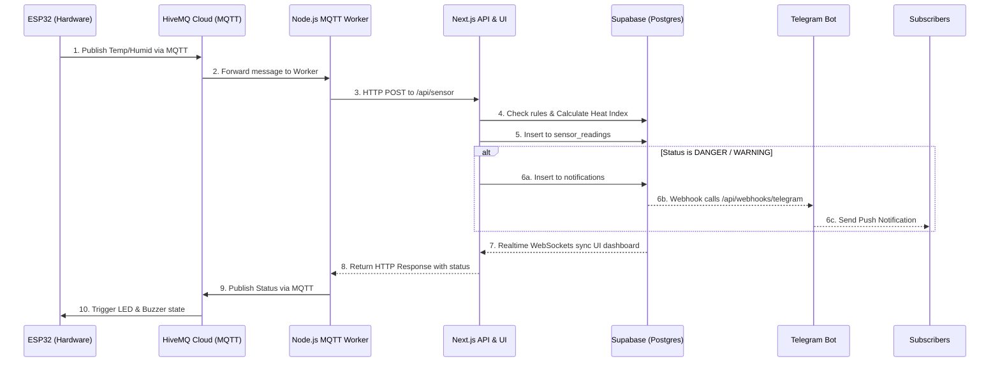

# Smart Maggot Box V2 

An enterprise grade Internet of Things (IoT) environmental monitoring system specifically designed for Black Soldier Fly (BSF) Maggot cultivation. 

BSF maggots require precise temperature and humidity ranges to thrive. This system provides real time monitoring, automated alerts, and comprehensive historical data analysis to ensure optimal breeding conditions and maximize yield.

##  Architecture Diagram



##  Comprehensive Tech Stack

### 1. Hardware: ESP32 & DHT22
* **Function:** Reads physical temperature and humidity in the cultivation box.
* **Reason:** Highly cost effective, built in WiFi capabilities, and reliable for continuous 24/7 monitoring in humid environments.

### 2. Connectivity: MQTT & HiveMQ Cloud
* **Function:** Facilitates bi directional communication between the hardware and the backend.
* **Reason:** MQTT is a lightweight publish/subscribe protocol ideal for IoT. It is significantly more battery and network efficient than standard HTTP polling, maintaining a low latency persistent connection.

### 3. Bridge: Node.js MQTT Worker (`mqtt-worker.js`)
* **Function:** Subscribes to the HiveMQ broker, listens for ESP32 payloads, and forwards them to the Next.js API.
* **Reason:** Next.js API routes are serverless and cannot natively maintain long lived MQTT subscriptions without timing out. The Node.js worker acts as a robust, persistent bridge connecting the MQTT world to the HTTP serverless world.

### 4. Backend & Database: Supabase (PostgreSQL)
* **Function:** Stores sensor readings, configurable warning rules, and alert notifications.
* **Reason:** Provides a powerful relational database out of the box, complete with Row Level Security (RLS) to lock down data access, and instant Realtime WebSockets to sync UI state seamlessly.

### 5. Frontend: Next.js 14 (App Router) & React
* **Function:** Serves as the administrative dashboard for monitoring metrics, configuring rules, generating reports, and managing settings.
* **Reason:** Next.js provides Server Side Rendering (SSR) for instantaneous initial page loads, excellent SEO characteristics, and secure API route integration.

### 6. UI/UX: Tailwind CSS, Framer Motion, Recharts
* **Function:** Handles styling, micro interactions, staggered mount animations, and historical data visualization.
* **Reason:** Ensures a fully responsive, mobile first design that feels professional, dynamic, and highly polished on any device.

### 7. External Alerts: Telegram Bot API
* **Function:** Sends instant push notifications for critical environmental changes and allows users to query system status.
* **Reason:** Telegram is a ubiquitous messaging platform, bypassing the high friction of building, deploying, and maintaining a custom mobile app strictly for push notifications.

##  Key Features

* **Real Time Dashboard:** Live metrics updated instantly via WebSockets, featuring a responsive grid and fluid animations.
* **Configurable Warning Rules:** Define custom thresholds (e.g., Temperature > 35C) to automatically trigger WARNING, DANGER, or CRITICAL alerts.
* **Data Reports & Export:** Analyze historical data with automatic period summaries. Export data directly to Industry Standard formats including Excel (.xlsx), CSV, TSV, and JSON.
* **Advanced Data Management:** Multi strategy deletion tool allowing admins to clear data by specific day, date ranges, age (older than N days), or by severity status to optimize database storage.
* **Interactive Telegram Bot:** Users can message the bot `/start` to see instructions, `/subscribe` to opt into real time alerts, `/status` to fetch current readings, and `/unsubscribe` to opt out. Admin dashboard also allows manual subscriber management.

##  Step by Step Setup Guide

### Phase 1: Database Setup (Supabase)
1. Create a new Supabase project.
2. Navigate to the SQL Editor and run the contents of `supabase/schema.sql` to generate the necessary tables and Row Level Security (RLS) policies.
3. Ensure the `ALTER PUBLICATION` commands at the end of the script are executed to enable Realtime WebSockets for the `sensor_readings` and `notifications` tables.

### Phase 2: Environment Configuration
1. Navigate to the `web` directory and copy `.env.example` to a new file named `.env.local`.
2. Populate the Supabase credentials (`NEXT_PUBLIC_SUPABASE_URL`, `NEXT_PUBLIC_SUPABASE_ANON_KEY`, `SUPABASE_SERVICE_ROLE_KEY`).
3. Populate the HiveMQ Cloud credentials (`HIVEMQ_HOST`, `HIVEMQ_PORT`, `HIVEMQ_USERNAME`, `HIVEMQ_PASSWORD`).

### Phase 3: Telegram Bot Integration
1. Open Telegram and message `@BotFather` to create a new bot and obtain your `TELEGRAM_BOT_TOKEN`. Add this token to `.env.local`.
2. In your Supabase Dashboard, navigate to **Database > Webhooks**.
3. Create a new Webhook triggered by `INSERT` events on the `notifications` table.
4. Set the Webhook URL to point to your deployed Next.js endpoint: `https://your-production-domain.com/api/webhooks/telegram`.

### Phase 4: Running the Platform Locally
You will need two terminal windows to run both the Web Server and the MQTT Bridge concurrently.

**Terminal 1: Next.js Server**
```bash
cd web
npm install
npm run dev
```

**Terminal 2: MQTT Worker**
```bash
cd web
node mqtt-worker.js
```

### Phase 5: Hardware Flashing
1. Open the `esp32` directory in the Arduino IDE or PlatformIO.
2. Update `esp32/smart_maggot_box/config.h` with your local WiFi credentials and HiveMQ connection details.
3. Flash the code to your ESP32 board.

## Important Notes & Best Practices

* **Telegram Webhook Deduplication:** Supabase Webhooks can sometimes fire multiple times for a single event. The `/api/webhooks/telegram` route implements a 30 second in memory deduplication window to prevent spam. Ensure you only have ONE active webhook configured in Supabase to avoid conflicting triggers.
* **Worker Persistence:** The `mqtt-worker.js` script must be running continuously to bridge hardware data to the database. In a production environment, this should be hosted on a persistent server (like an EC2 instance or a DigitalOcean Droplet) using a process manager such as `pm2` or encapsulated in a Docker container.
* **RLS and API Routes:** The frontend dashboard communicates with secure Next.js API routes (e.g., `/api/rules`) rather than querying Supabase directly for write operations. These API routes utilize the Supabase Service Role Key to safely bypass Anon read only restrictions without compromising database security.
