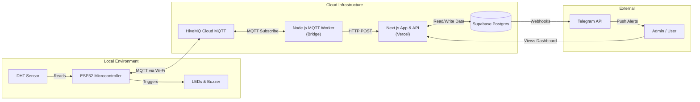
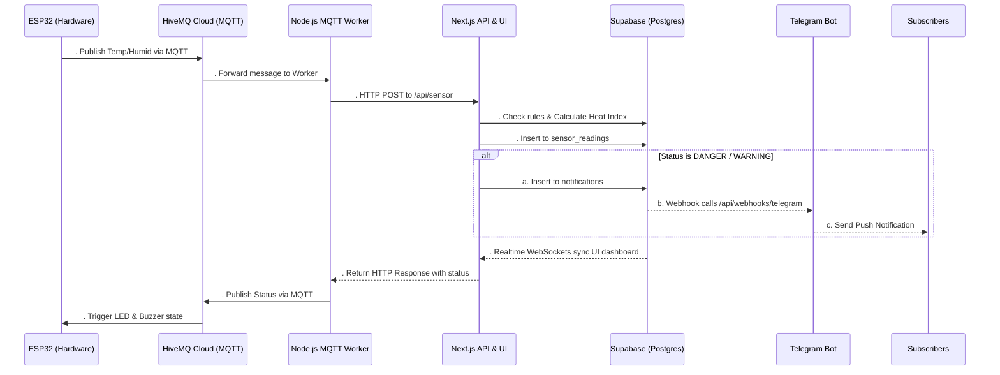
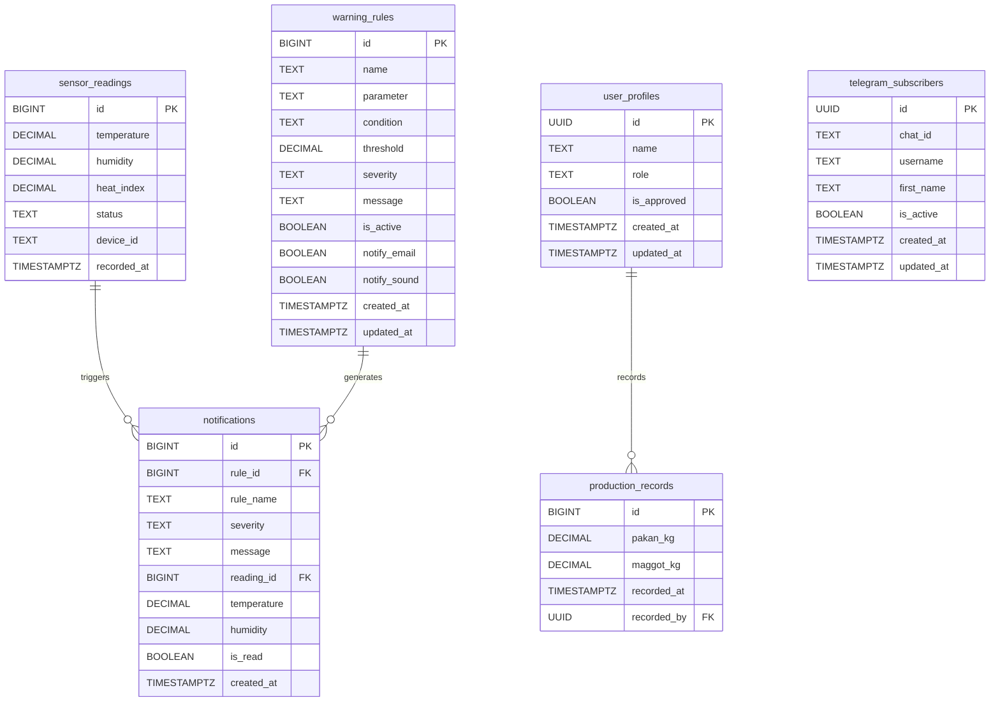

# O'Maggot Box V2

An enterprise-grade Internet of Things (IoT) environmental monitoring system specifically designed for Black Soldier Fly (BSF) Maggot cultivation.

BSF maggots require precise temperature and humidity ranges to thrive. This system provides real-time monitoring, automated alerts, and comprehensive historical data analysis to ensure optimal breeding conditions and maximize yield.

---

## System Architecture

To help developers and stakeholders understand the system at a glance, here is the breakdown of physical hardware, cloud services, and the database.

### 1. Component Architecture

This diagram outlines the physical and cloud boundaries of the system.



Explanation: This diagram maps out the physical and logical boundaries of the system. In the Local Environment, the ESP32 microcontroller interfaces directly with DHT sensors to gather climate data, controlling physical actuators (LEDs & Buzzer) based on status changes. Because the ESP32 operates on limited power/compute, it streams data to a Cloud Infrastructure layer using the lightweight MQTT protocol via HiveMQ. A Node.js Worker bridges this MQTT stream into our Next.js API, which stores the data securely in Supabase. Finally, the External layer shows how end-users interact with the system - either by viewing the Next.js Dashboard or receiving automated webhook alerts pushed through the Telegram API.

 . Data Flow (Sequence)

This diagram illustrates the chronological step-by-step flow when a sensor reading occurs.



Explanation: This sequence diagram traces the complete journey of a single sensor reading. It starts on the left when the ESP32 publishes a payload. The HiveMQ broker routes this to our Node.js Worker, which fires an HTTP POST to the Next.js backend. Inside Next.js, business logic executes: it calculates the Heat Index and evaluates the reading against active warning rules. The data is saved to Supabase Postgres. If a rule triggers a Warning or Danger state, Supabase immediately fires a webhook to Telegram to alert farmers. Simultaneously, Supabase's Realtime engine pushes the new data via WebSockets to any admin viewing the Dashboard. Finally, the resulting status is sent back down the chain to the ESP32 so it can trigger local visual/audio alarms (LEDs/Buzzer).

 . Database Schema (ERD)

This Entity-Relationship Diagram details the relational PostgreSQL database structure hosted on Supabase.



Explanation: The ERD represents the relational structure of our Supabase PostgreSQL database. At its core is the `sensor_readings` table storing chronological climate data. The `warning_rules` table stores the user-defined thresholds (e.g., "Alert if Temperature > "). When a reading violates a rule, a record is generated in the `notifications` table, linking the specific reading and rule together for historical auditing. The `production_records` table stores manual inputs for feed (pakan) and harvested maggots, which are used to generate AI-driven insights like FCR and Daily Growth Rate. Separately, the system handles access control via `user_profiles` (which ties into Supabase Auth) and manages alert recipients in the `telegram_subscribers` table.

---

## Critical Analysis: Why These Technologies?

Building a reliable IoT system requires bridging the gap between embedded hardware (C++), continuous data streams, and modern web applications. Here is the critical reasoning behind our technology stack choices:

 . Supabase (PostgreSQL) vs Traditional Databases

- What we needed: A secure database that can handle rapid time-series inserts from IoT devices, while instantly updating the frontend dashboard without heavy polling.
- Why we chose it: Supabase provides PostgreSQL out of the box with built-in Row Level Security (RLS) and Realtime WebSockets.
- The Benefit: Instead of writing complex WebSocket servers (Socket.io) to push new temperature readings to the browser, Supabase Realtime allows the Next.js frontend to simply subscribe to database changes. RLS ensures that public users cannot write or delete data directly from the browser, pushing all write-privileges to secure backend API routes.

 . Next.js App Router vs Express.js

- What we needed: A robust administrative dashboard and secure API endpoints to process rules.
- Why we chose it: Next.js provides Server-Side Rendering (SSR) and seamless API routes in a single repository.
- The Benefit: Deploying to Vercel is trivial, SEO is perfect (if the landing page scales), and UI components (Tailwind, Framer Motion) integrate seamlessly. However, because Vercel API routes are serverless (they shut down when not in use), they cannot hold open continuous MQTT connections. This limitation led directly to the next architectural decision:

 . MQTT (HiveMQ) + Node.js Worker Bridge

- What we needed: A reliable way for the ESP32 to stream data / without draining battery or dropping packets due to HTTP overhead.
- Why we chose it: MQTT is the industry standard for IoT - it is lightweight, requires minimal bandwidth, and maintains persistent connections. Since Next.js serverless functions cannot subscribe to MQTT continuously, we introduced a standalone Node.js MQTT Worker.
- The Benefit: The Worker acts as a translator. It holds the persistent MQTT connection open, receives the ultra-lightweight payload from the ESP32, and fires a standard HTTP POST request to the Next.js API. This gives us the best of both worlds: efficient IoT hardware communication and scalable serverless backend APIs.

 . Telegram Bot over Custom Push Notifications

- What we needed: Immediate alerts to farmers when the maggot box temperature reaches DANGER levels.
- Why we chose it: Building a custom mobile app strictly for push notifications is expensive, hard to maintain, and causes friction (users don't want to download another app).
- The Benefit: Telegram offers a free, highly reliable Bot API. Farmers simply send `/subscribe` to the bot, and Supabase Database Webhooks automatically POST to our API which pushes the alert to Telegram. Zero app installations required, instant delivery.

---

## Deep Dive: How the ESP32 Talks to the Web (and Why It Doesn't Need Your Local Network)

This is one of the most critical and commonly misunderstood aspects of the system. A naive IoT implementation would require the ESP32 and the web server to be on the same WiFi network, making it useless the moment you leave home. O'Maggot Box V2 is built differently, and understanding why requires unpacking each layer.

 The Core Problem with Local-Only Architectures

Imagine the simple approach: ESP32 sends an HTTP POST directly to `http://localhost:/api/sensor`. This works when your laptop (running the Next.js server) and the ESP32 box are on the same router. The moment you close your laptop, unplug it, or the farmer wants to check the dashboard from their phone while at a market, the entire system is dead. This is not a monitoring system - it is a desk toy.

The question becomes: how do you make an embedded device with no fixed IP address, sitting on a random home router behind NAT, reliably send data to a cloud server and receive commands back?

 The Answer: A Cloud MQTT Broker as the Universal Middleman

The solution is to introduce a third-party cloud broker that both the ESP32 and the server can always reach over the public internet. Both parties connect outward to this shared broker, so neither needs to know the other's location, IP address, or local network.

```
                        [ PUBLIC INTERNET ]

  ESP32 (anywhere)  --------------------------  HiveMQ Cloud Broker
  (port  / TLS)                              (fixed public address)
                                                        |
  Node.js Worker    ---------------------------------
  (anywhere)        (subscribes to the same broker)
```

This is the MQTT Publish-Subscribe pattern. The ESP32 never talks to the server directly. The server never talks to the ESP32 directly. They both talk through a neutral broker. This is a fundamental architectural shift from the request-response model of HTTP.

 Step-by-Step: A Single Reading, Traced End-to-End

Step  - ESP32 Reads Sensor Data

The DHT sensor is polled every  seconds. Two float values are produced: `temperature` (°C) and `humidity` (% RH). These are packed into a compact JSON string. The payload is deliberately minimal - under  bytes. No HTTP headers, no cookies, no session tokens. MQTT handles the framing. Compare this to a full HTTP POST request which carries - bytes of headers alone. For a device sending data every  seconds, /, this bandwidth efficiency matters significantly.

Step  - ESP32 Publishes via MQTT over TLS (port )

The ESP32 establishes a persistent TCP connection to the HiveMQ Cloud broker on port  - the IANA-assigned port for MQTT over TLS (equivalent to port  for HTTPS). The connection is fully encrypted. The current implementation uses `setInsecure()` mode, meaning data is encrypted in transit but the server certificate chain is not verified by the client. This is an accepted trade-off for a prototype; full certificate pinning would require embedding a Root CA into the firmware.

The payload is published to the topic `omaggot/sensor/data`. An MQTT topic is simply a routing address - a string that acts like a channel name. Anyone subscribed to that string will receive a copy of the message. The ESP32 does not need to know who is listening or where they are.

Step  - HiveMQ Cloud Brokers the Message

HiveMQ is a managed, enterprise-grade MQTT broker running on permanent cloud infrastructure. The instant the ESP32 publishes, HiveMQ forwards a copy to every active subscriber on that topic. The ESP32 is completely unaware of the server's existence, IP address, or current state.

Why HiveMQ over a self-hosted Mosquitto? A local Mosquitto broker on your laptop has the exact same problem as a local Next.js server - it is not reachable from the public internet without port forwarding, a static public IP, and DNS configuration. HiveMQ Cloud provides a permanent, resolvable public hostname with authentication and TLS included, on a free developer tier.

Step  - Node.js MQTT Worker Receives the Message

The Node.js Worker (`mqtt-worker.js`) runs as a long-lived process, completely separate from Next.js. It maintains a persistent, stateful MQTT connection to HiveMQ and is subscribed to `omaggot/sensor/data`.

This separate process exists for a non-obvious but critical architectural reason: Next.js on Vercel runs as serverless functions. A serverless function boots on demand for one request, then shuts down after a few seconds of inactivity. It has no persistent memory, no open sockets between calls. You cannot hold an MQTT connection inside a serverless function because the connection would die between sensor readings. MQTT is a stateful protocol requiring a long-lived TCP connection - fundamentally incompatible with the serverless model.

The Node.js Worker solves this. It is the only always-on process in the system. It holds the one persistent MQTT connection and converts each incoming MQTT message into a discrete HTTP POST that Next.js can handle statelessly.

Step  - Worker Forwards Data to the Next.js API

The Worker fires `POST /api/sensor` with the sensor JSON as the body. From Next.js's perspective, this is an ordinary HTTP request. It does not know or care that the data originated from MQTT or an ESP32.

Step  - Next.js Processes, Evaluates, and Persists

The server-side API route:
. Validates the device ID and API key (guards against spoofed data injection from unknown sources).
. Calculates the Heat Index server-side from the temperature and humidity values using the Rothfusz formula.
. Fetches all active `warning_rules` from the database and evaluates each one against the new reading.
. Determines the final `status` (NORMAL, WARNING, or DANGER).
. Inserts the reading into `sensor_readings` in Supabase.
. If the status is WARNING or DANGER: inserts a record into `notifications`. This triggers a Supabase Database Webhook, which calls the Telegram endpoint and sends an alert to all active subscribers.
. Returns the computed `status` in the HTTP response body.

Step  - Status Flows Back to the Physical Device

The Worker receives the HTTP response containing the `status` string. It immediately publishes this value to the topic `omaggot/sensor/status`. The ESP32, which is subscribed to this topic, receives it through its MQTT callback function. The internal `currentStatus` variable is updated, and on the next `loop()` iteration, the hardware indicators (LEDs, buzzer) are set accordingly. This closes the feedback loop: the physical device reflects the server's computed verdict.

Step  - Dashboard Updates with Zero Polling

When a new row is inserted into `sensor_readings`, Supabase's Realtime engine (built on PostgreSQL logical replication) detects the change and broadcasts it over a persistent WebSocket to all connected browsers. The dashboard updates the chart and metric cards instantly - no `setInterval` polling, no page refresh, no manual HTTP requests. The dashboard is a live mirror of the database.

 Why No Same-Network Requirement: Summary Table

| Component | Connection type | Why location is irrelevant |
|:---|:---|:---|
| ESP32 | Outbound TCP to HiveMQ (port ) | Any WiFi with internet works. Home, farm, cafe - anywhere. |
| MQTT Worker | Outbound TCP to HiveMQ (port ) | Runs on any machine with internet. Same machine as Next.js or a different one entirely. |
| Next.js API | Receives inbound HTTP from Worker | Worker calls it by URL (`localhost:` or a Vercel domain). Server location is irrelevant. |
| Browser Dashboard | Outbound WebSocket to Supabase Realtime | Works from any device with a browser and internet access. |
| Telegram Webhook | Supabase calls Next.js public URL | Both are cloud services. No local networking involved. |

The ESP32 never makes a direct connection to Next.js. It never needs to know the server's IP address or domain. All it needs is the fixed, permanent HiveMQ broker hostname. This means the Next.js server can be deployed to Vercel or running locally on port  - the ESP32 is oblivious to the difference. The ESP32 can be in a farm in East Java while the developer monitors the dashboard from a laptop in Bandung or Singapore. The system survives server restarts, IP changes, and full Next.js redeployments, as long as HiveMQ remains reachable and the Worker is running.

 Security Considerations and Critical Trade-offs

`setInsecure()` on ESP32 TLS: Data is fully encrypted in transit, so no one eavesdropping can read sensor values. However, the ESP32 does not verify it is talking to the real HiveMQ server, opening a theoretical man-in-the-middle vulnerability. In production, you would load the HiveMQ root CA certificate using `setCACert()`.

API Key in `config.h`: The API key is hardcoded and committed to the repository. Even if an attacker obtained it, the worst they can do is inject fake sensor readings. They cannot read admin data, modify rules, or delete records, because those operations require Supabase Auth tokens which are never stored on or near the ESP32.

MQTT Credentials in `config.h`: An attacker with these credentials could subscribe to the sensor data topic (reading raw readings - a privacy concern) or publish fake data. In production, credentials would be provisioned securely via a device management platform.

Supabase RLS as the True Security Backstop: Regardless of the above vulnerabilities, Row Level Security on Supabase ensures the database cannot be manipulated without valid Supabase Auth tokens. The `service_role` key - which bypasses RLS and is used by the server-side API - is stored only as a server-side environment variable, never exposed to the browser, the ESP32, or the Worker. Even a fully compromised ESP32 cannot touch the database schema, delete data, or access other users' records.

---

## Heat Index (Indeks Kenyamanan)

In the BSF (Black Soldier Fly) cultivation process, it's not just the absolute temperature that matters, but how "hot" the environment feels to the maggots when combined with humidity. This is known as the Heat Index.

The system automatically calculates the Heat Index server-side using a modified Rothfusz formula whenever temperature and humidity readings are received.

Calculation Range & Rules:

- The formula is only applied when the temperature is &ge; . °C and the humidity is &ge; %.
- If the environmental conditions are below these thresholds, the system defaults the Heat Index to be equal to the current temperature, as the humidity does not significantly amplify the perceived heat.
- This computed value is then evaluated against user-defined threshold rules (Normal, Warning, Danger) exactly like raw temperature or humidity.

---

## Pembagian Roles (Role Distribution & Access Control)

To maintain strict security - especially concerning hardware simulation and alert rule modifications - the system implements a robust Role-Based Access Control (RBAC) mechanism.

There are three distinct roles in the system. Here is exactly what they can and cannot do:

| Feature / Capability | User (Normal) | Admin (Pending) | Admin (Approved) | Superadmin |
| :--- | :---: | :---: | :---: | :---: |
| View Live Dashboard | ✅ | ✅ | ✅ | ✅ |
| View Reports & Export Data| ✅ | ✅ | ✅ | ✅ |
| View Warning Rules | ✅ | ✅ | ✅ | ✅ |
| Create / Edit / Delete Rules| ⌠| ⌠| ✅ | ✅ |
| Input Production Data (Feed/Maggot)| ⌠| ⌠| ✅ | ✅ |
| Toggle Rules On/Off | ⌠| ⌠| ✅ | ✅ |
| Delete Sensor Data (Reports)| ⌠| ⌠| ✅ | ✅ |
| Trigger Test Notifications | ⌠| ⌠| ✅ | ✅ |
| Trigger Hardware Simulation| ⌠| ⌠| ✅ | ✅ |
| Manage / Remove Subscribers| ⌠| ⌠| ✅ | ✅ |
| Approve / Reject Admins | ⌠| ⌠| ⌠| ✅ |

 System Use Case Diagram

The following diagram illustrates the functionalities from the perspective of the three primary roles, using standard UML actor-inheritance conventions.

```mermaid
flowchart LR
    %% Actors
    User([User])
    Admin([Admin])
    Superadmin([Superadmin])

    %% Inheritance (Generalization)
    Superadmin -.->|inherits| Admin
    Admin -.->|inherits| User

    %% System Boundary
    subgraph O_Maggot_System [O'Maggot Box System]
        direction TB

        %% Use Cases
        UC_Auth(Authenticate / Login)

        UC_Dash(View Live Dashboard)
        UC_Rep(View Historical Reports)
        UC_Exp(Export Data)

        UC_ViewRule(View Warning Rules)
        UC_MgmtRule(Manage Rules)
        UC_TestNotif(Trigger Test Notifications)
        UC_Production(Input Production Data)

        UC_Simulate(Trigger Hardware Simulation)
        UC_DelData(Delete Sensor Data)
        UC_Subscribers(Manage Telegram Subscribers)

        UC_UserMgmt(Manage Users)
        UC_Approve(Approve/Reject Admins)

        %% Include relationships (Mandatory)
        UC_Dash -.->|"«include»"| UC_Auth
        UC_Rep -.->|"«include»"| UC_Auth
        UC_ViewRule -.->|"«include»"| UC_Auth

        %% Extend relationships (Optional behavior)
        UC_Exp -.->|"«extend»"| UC_Rep
        UC_MgmtRule -.->|"«extend»"| UC_ViewRule
        UC_TestNotif -.->|"«extend»"| UC_MgmtRule
        UC_Approve -.->|"«extend»"| UC_UserMgmt
    end

    %% Actor to Use Case Relationships
    User --> UC_Dash
    User --> UC_Rep
    User --> UC_ViewRule

    Admin --> UC_MgmtRule
    Admin --> UC_Production
    Admin --> UC_Simulate
    Admin --> UC_DelData
    Admin --> UC_Subscribers

    Superadmin --> UC_UserMgmt

    classDef actor fill:fff,stroke:,stroke-width:px,color:;
    classDef usecase fill:effe,stroke:d,stroke-width:px,color:;
    class User,Admin,Superadmin actor;
    class UC_Auth,UC_Dash,UC_Rep,UC_Exp,UC_ViewRule,UC_MgmtRule,UC_TestNotif,UC_Production,UC_Simulate,UC_DelData,UC_Subscribers,UC_UserMgmt,UC_Approve usecase;
```



Explanation:

- Actors & Inheritance: We use standard UML actor generalization (`--|>`). The `Superadmin` inherits everything from `Admin`, and `Admin` inherits everything from `User`.
- `«include»` (Mandatory): Viewing the Dashboard, Reports, or Rules strictly requires the user to Authenticate / Login first. The base use cases cannot execute without it.
- `«extend»` (Optional): Extending use cases provide optional functionality to a base use case. For example, while viewing reports, a user can optionally Export Data to CSV. While viewing rules, an Admin can optionally Manage Rules (Create/Edit/Toggle). While managing users, a Superadmin can optionally Approve/Reject Admins.
- Roles:
  - User (Normal User): Has read-only capabilities (Dashboard, Reports, Rules).
  - Admin (Approved): Gains write-access to the system state (Managing rules, deleting data, testing hardware/notifications).
  - Superadmin: The highest-level actor with exclusive authority over User Management.

 The "Pending Admin" Workflow (State Diagram)

To prevent anyone from registering as an Admin and immediately messing with critical temperature thresholds, we introduced an `is_approved` flag.

```mermaid
stateDiagram-v
    [] --> Registration
    Registration --> User : Selects "User"
    Registration --> Admin_Pending : Selects "Admin"

    Admin_Pending --> Dashboard : Read-only access
    Admin_Pending --> Admin_Approved : Superadmin clicks "Approve"
    Admin_Approved --> FullAccess : Can edit rules & hardware

    Superadmin --> UserManagement : Has exclusive access to tab
```

> [!IMPORTANT]
> Creating the First Superadmin:
> For maximum security, the "Superadmin" role cannot be selected via the UI during registration. Hardcoding a secret path to become a Superadmin is a massive security vulnerability.
>
> You must promote your first account manually via the database:
>
> . Register an account normally at `/register`.
> . Open the Supabase Dashboard SQL Editor.
> . Run the following query:
>
>    ```sql
>    UPDATE user_profiles
>    SET role = 'superadmin', is_approved = true
>    WHERE id = (SELECT id FROM auth.users WHERE email = 'your@email.com');
>    ```
>
> . Refresh your dashboard. You will now see the exclusive User Management tab, allowing you to securely approve all future Admins from the UI.

---

## Step-by-Step Setup Guide

 Phase : Database Setup (Supabase)

. Create a new Supabase project.
. In the root directory, open `setup-db.js` and update the connection string with your Supabase database URL and password.
. Run `node setup-db.js` to automatically generate the necessary tables, Row-Level Security (RLS) policies, and enable Realtime WebSockets.

 Phase : Environment Configuration

. Navigate to the `web` directory and copy `.env.example` to a new file named `.env.local`.
. Populate the Supabase credentials (`NEXT_PUBLIC_SUPABASE_URL`, `NEXT_PUBLIC_SUPABASE_ANON_KEY`, `SUPABASE_SERVICE_ROLE_KEY`).
. Populate the HiveMQ Cloud credentials (`HIVEMQ_HOST`, `HIVEMQ_PORT`, `HIVEMQ_USERNAME`, `HIVEMQ_PASSWORD`).
. Define a secure `ESP_API_KEY` to authenticate incoming sensor payloads from the Worker.
. Define `NEXT_PUBLIC_APP_URL` (e.g., `http://localhost:` or your production domain).

 Phase : Telegram Bot Integration
>
> [!WARNING]
> Local Development Note: Telegram webhooks cannot reach `http://localhost`. If you are testing locally, you MUST use a tunneling service like [Ngrok](https://ngrok.com/) (`ngrok http `) and use the Ngrok URL for your webhooks, OR deploy your Next.js app to Vercel first.

. Open Telegram, message `@BotFather`, create a new bot, and copy your `TELEGRAM_BOT_TOKEN` into `.env.local`.
. Inbound Webhook (Bot Commands): Register your Next.js API with Telegram so it can receive `/start` and `/subscribe` commands. Open your browser and navigate to:
   `https://api.telegram.org/bot<YOUR_TOKEN>/setWebhook?url=https://your-public-domain.com/api/webhooks/telegram-bot`
. Outbound Webhook (Alerts): In your Supabase Dashboard, navigate to Database > Webhooks.
. Create a new Webhook triggered by `INSERT` events on the `notifications` table.
. Set the Webhook URL to point to your deployed endpoint: `https://your-public-domain.com/api/webhooks/telegram`.

 Phase : Running the Platform Locally

You will need two terminal windows to run both the Web Server and the MQTT Bridge concurrently.

Terminal : Next.js Server

```bash
cd web
npm install
npm run dev
```

Terminal : MQTT Worker Bridge

```bash
cd web
node mqtt-worker.js
```

 Phase : Hardware Flashing (ESP32)

. Wiring: Please refer to the [ESP32 Hardware Guide](esp/README.md) for the GPIO pinout schema.
. Open the `esp/omaggot_box` directory in the Arduino IDE.
. Install required libraries: `WiFiManager`, `PubSubClient`, `ArduinoJson`, `DHT sensor library`.
. Update `esp/omaggot_box/config.h` with your HiveMQ connection details.
. Flash the code to your ESP32.
. On boot, the ESP32 will host a "OMaggot-Setup" Wi-Fi network. Connect to it via your phone to input your local Wi-Fi credentials dynamically.
