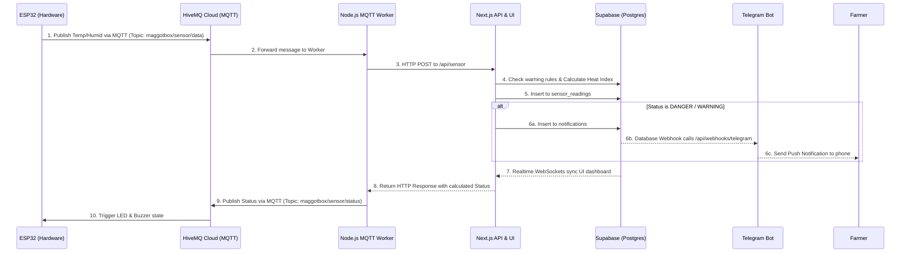

# Smart Maggot Box V2 🪰🚀

An enterprise-grade, highly-optimized IoT environmental monitoring system for Black Soldier Fly (BSF) Maggot cultivation. Built with ESP32, Next.js, Supabase, and HiveMQ.

---

## 🏗️ Architecture Diagram



---

## 🛠️ Comprehensive Tech Stack Breakdown

### 1. Hardware & Connectivity (ESP32 & HiveMQ)
- **ESP32 / ESP8266**: The brains of the physical box. It reads the `DHT11`/`DHT22` sensor.
- **Protocol: MQTT via HiveMQ Cloud**: In V1, the ESP32 used HTTP POST. HTTP is incredibly heavy for microcontrollers (requiring TLS handshakes every 10 seconds). In V2, we migrated to **MQTT** using `PubSubClient`. The ESP32 maintains a persistent, low-power connection to HiveMQ Cloud. It publishes sensor data and subscribes to a status topic to receive immediate commands (like triggering the buzzer).

### 2. The Bridge (Node.js MQTT Worker)
- **`mqtt-worker.js`**: Next.js App Router (Serverless) cannot natively maintain a long-running MQTT subscription without timing out. To solve this, we implemented a lightweight Node.js worker script. It connects to HiveMQ, listens to the ESP32, and acts as a bridge—passing the MQTT payload to the Next.js `/api/sensor` route and relaying the system status back to the ESP32.

### 3. Backend & Database (Supabase)
- **PostgreSQL Database**: Handles heavily relational data (`sensor_readings`, `warning_rules`, `notifications`).
- **Row Level Security (RLS)**: The database is locked down. The public Anon Key can only read data, preventing malicious users from deleting sensor history. Only the authenticated Backend Service Role can insert data.
- **Supabase Realtime (WebSockets)**: The Next.js dashboard uses `supabase.channel()` to instantly update charts and alerts without refreshing the page or spamming the API with polling.
- **Database Webhooks**: Whenever a row is inserted into the `notifications` table, Supabase instantly fires a webhook to the Next.js server to trigger external alerts.

### 4. Frontend & User Experience (Next.js & React)
- **Next.js 14 App Router**: The core framework.
- **React Server Components (RSC)**: In V2, the dashboard `page.tsx` was refactored into a Server Component. It fetches the initial 50 rows of historical data directly on the server *before* rendering. This guarantees a 0ms layout shift and an instantaneous initial load, passing the data to the `DashboardClient` which then takes over the Realtime WebSockets.
- **Progressive Web App (PWA)**: Using `@ducanh2912/next-pwa`, the dashboard is now installable natively on iOS, Android, macOS, and Windows. It hides the browser UI and acts as a standalone application.
- **UI & Visualization**: Tailwind CSS v4 handles styling cleanly, while `recharts` renders the historical Area Chart.

### 5. External Integrations (Telegram)
- **Telegram Bot API**: Connected directly to the Supabase Webhook. Even if the dashboard is closed, critical warnings will instantly ping your phone.

---

## 🚀 Quick Start Guide

### 1. Database & Security Setup
1. Run `supabase/schema.sql` in your Supabase SQL Editor to generate the tables and the essential **RLS Policies**.
2. Run the `ALTER PUBLICATION` lines at the bottom of the SQL script to enable Realtime capabilities for the UI.

### 2. HiveMQ & Telegram Credentials
Copy `.env.example` to `web/.env.local` and add:
```env
# Supabase
NEXT_PUBLIC_SUPABASE_URL=...
NEXT_PUBLIC_SUPABASE_ANON_KEY=...
SUPABASE_SERVICE_ROLE_KEY=...

# HiveMQ Cloud
HIVEMQ_HOST=your-cluster.hivemq.cloud
HIVEMQ_PORT=8883
HIVEMQ_USERNAME=your_user
HIVEMQ_PASSWORD=your_pass

# Telegram
TELEGRAM_BOT_TOKEN=your_botfather_token
TELEGRAM_CHAT_ID=your_chat_id
```

### 3. Running the Stack
You need two terminal windows to run both the Web Server and the MQTT Bridge.

**Terminal 1 (Next.js Server):**
```bash
cd web
npm install
npm run dev
```

**Terminal 2 (MQTT Worker):**
```bash
cd web
node mqtt-worker.js
```

### 4. Hardware Flash
Update `esp32/smart_maggot_box/config.h` with your WiFi and HiveMQ credentials, then flash it to your ESP32.

---
*V2: Highly optimized, memory safe, and extremely scalable.*
