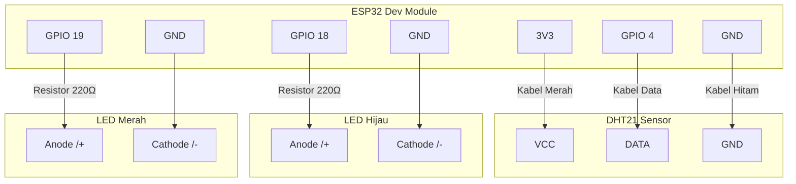

# O'Maggot Box - ESP32 Hardware

## Persyaratan (Hardware)

- ESP32 Development Module
- Sensor Suhu & Kelembaban DHT21
- 1x LED Merah
- 1x LED Hijau
- Kabel USB
- Breadboard
- Kabel Jumper secukupnya

## Persyaratan (Software)

- Arduino IDE 2.x
- Board di Arduino IDE: Pilih **DOIT ESP32 DEVKIT V1** atau **ESP32 Dev Module**
- URL Board ESP32: `https://raw.githubusercontent.com/espressif/arduino-esp32/gh-pages/package_esp32_index.json`
- Library `DHT sensor library` by Adafruit
- Library `ArduinoJson` by Benoit Blanchon

## Setup Hardware

1. Hubungkan DHT21 VCC ke 3V3, GND ke GND, dan Data ke GPIO 4.
2. Hubungkan LED Hijau ke GPIO 18 (tambahkan resistor 220Ω).
3. Hubungkan LED Merah ke GPIO 19 (tambahkan resistor 220Ω).

### Diagram Pemasangan (Wiring)

## Konfigurasi

<!-- 1. Buka file `config.h`.
2. Ubah `WIFI_SSID` dan `WIFI_PASSWORD` sesuai dengan koneksi Anda.
3. Ubah `API_URL` dengan alamat IP lokal komputer tempat Next.js berjalan (contoh: `http://192.168.1.10:3000/api/sensor`).
4. Upload `smart_maggot_box.ino` ke board ESP32 Anda. -->

semuanya sudah menggunakan WifiManager
