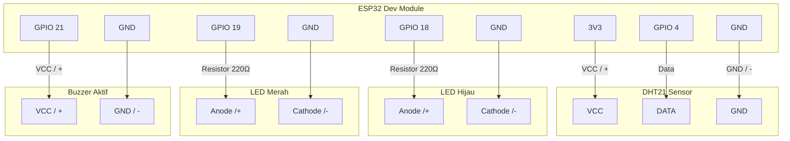

# O'Maggot Box - ESP32 Hardware

## Persyaratan (Hardware)

- ESP32 Development Module
- Sensor Suhu & Kelembaban DHT21
- 1x LED Merah
- 1x LED Hijau
- 1x Buzzer Aktif (5V / 3.3V)
- Kabel USB
- Breadboard
- Kabel Jumper secukupnya

## Persyaratan (Software)

- Arduino IDE 2.x
- Board di Arduino IDE: Pilih **DOIT ESP32 DEVKIT V1** atau **ESP32 Dev Module**
- URL Board ESP32: `https://raw.githubusercontent.com/espressif/arduino-esp32/gh-pages/package_esp32_index.json`
- Library `DHT sensor library` by Adafruit
- Library `ArduinoJson` by Benoit Blanchon

## Setup Hardware

1. Hubungkan DHT21 VCC ke 3V3, GND ke GND, dan Data ke GPIO 4.
2. Hubungkan LED Hijau ke GPIO 18 (tambahkan resistor 220Ω).
3. Hubungkan LED Merah ke GPIO 19 (tambahkan resistor 220Ω).
4. Hubungkan Buzzer ke GPIO 21.

### Diagram Pemasangan (Wiring)

### Penjelasan Pemasangan Kabel (Wiring Guide)

**1. Sensor Suhu & Kelembaban (DHT21)**
- **VCC (Kutub Positif / +)**: Dihubungkan ke pin **3V3** pada ESP32. Pin ini memberikan daya 3.3 Volt yang dibutuhkan sensor DHT21 untuk beroperasi.
- **GND (Kutub Negatif / -)**: Dihubungkan ke salah satu pin **GND (Ground)** pada ESP32. Ini berfungsi sebagai kutub negatif jalur kembalinya arus listrik.
- **DATA (Pin Data)**: Dihubungkan ke pin **GPIO 4 (D4)** pada ESP32. Jalur ini digunakan sensor untuk mengirimkan data pembacaan suhu dan kelembaban digital agar dapat dibaca oleh ESP32.

**2. Indikator LED Hijau (Status Aman/Normal)**
- **Anoda (Kaki Panjang / +)**: Dihubungkan ke pin **GPIO 18 (D18)** pada ESP32 **melalui sebuah Resistor 220Ω**. Resistor ini sangat penting karena berfungsi membatasi arus listrik dari pin ESP32 agar LED tidak terbakar/putus akibat arus yang terlalu besar.
- **Katoda (Kaki Pendek / -)**: Dihubungkan ke salah satu pin **GND** pada ESP32.

**3. Indikator LED Merah (Status Bahaya/Peringatan)**
- **Anoda (Kaki Panjang / +)**: Dihubungkan ke pin **GPIO 19 (D19)** pada ESP32 **melalui sebuah Resistor 220Ω**, tujuannya sama seperti pada LED Hijau untuk mencegah kerusakan komponen.
- **Katoda (Kaki Pendek / -)**: Dihubungkan ke salah satu pin **GND** pada ESP32.

**4. Buzzer Aktif (Alarm Audio)**
- **Kutub Positif (VCC / +)**: Dihubungkan ke pin **GPIO 21 (D21)** pada ESP32. Pin ini akan memberikan tegangan HIGH saat suhu/kelembaban memasuki batas bahaya untuk membunyikan alarm.
- **Kutub Negatif (GND / -)**: Dihubungkan ke salah satu pin **GND** pada ESP32.

> **Tips Merakit dengan Breadboard:**
> Karena ESP32 hanya memiliki beberapa pin GND, Anda disarankan menggunakan **Breadboard**. Hubungkan satu pin GND dari ESP32 ke jalur memanjang (biasanya ditandai garis biru/-) di breadboard. Setelah itu, Anda bisa menghubungkan GND dari DHT21, Katoda LED Hijau, Katoda LED Merah, dan GND Buzzer ke jalur biru breadboard tersebut secara bersamaan.

## Konfigurasi & Upload (Menggunakan WiFiManager)

Sistem ESP32 ini **sudah tidak lagi menggunakan hardcode WiFi** (Anda tidak perlu menulis SSID dan Password jaringan secara manual di dalam file program). Sistem ini telah terintegrasi dengan library **WiFiManager** sehingga pengaturan WiFi bisa dilakukan secara dinamis layaknya menyambungkan perangkat pintar IoT pintar.

**Langkah-langkah upload dan menghubungkan ESP32:**

1. Buka folder `esp32` menggunakan Arduino IDE dan buka file `smart_maggot_box.ino`.
2. Buka file `config.h` hanya jika Anda perlu mengubah konfigurasi koneksi broker MQTT (HiveMQ) atau pengaturan pin. *Tidak perlu mencari variabel WiFi di sini*.
3. Hubungkan ESP32 ke komputer dengan kabel USB. Pastikan Board (ESP32 Dev Module) dan Port USB sudah terpilih dengan benar.
4. Klik tombol **Upload** dan tunggu hingga proses compile selesai.
5. **Mode Access Point (AP)**: Saat ESP32 pertama kali dinyalakan (atau jika WiFi lama tidak ditemukan), ESP32 akan memancarkan sinyal WiFi sendiri.
6. Gunakan smartphone atau laptop Anda, buka pengaturan WiFi, lalu cari dan hubungkan ke hotspot jaringan bernama **"MaggotBox-Setup"** (atau nama default dari WiFiManager).
7. **Captive Portal**: Setelah terhubung, layar ponsel Anda biasanya akan otomatis membuka halaman konfigurasi (seperti saat login WiFi publik). Jika tidak terbuka otomatis, buka browser dan akses alamat IP **`192.168.4.1`**.
8. Klik tombol **"Configure WiFi"**, pilih nama WiFi (SSID) rumah/lokasi Anda dari daftar yang muncul, masukkan password WiFi Anda, lalu klik **Save**.
9. ESP32 akan merestart otomatis, keluar dari mode AP, dan langsung terhubung ke jaringan internet yang baru saja Anda masukkan.
